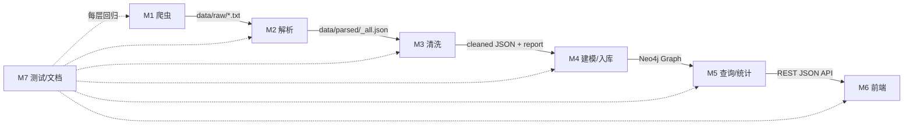

# 小组任务分配

> **项目**：职业规划知识图谱（JD-Based Career Planning Knowledge Graph）
> **小组人数**：7 人
> **分配日期**：2026-04-21
> **分配原则**：以功能模块为单位划分；每人包含"已完成功能的维护/测试"与"后续新功能的主导开发"两部分；每人工作量按"核心开发 + 测试/文档 + 联调"三栏折算，整体 ≈ 等量。

---

## 一、项目功能总览

当前工作空间包含四个子项目：

| 子项目 | 状态 | 说明 |
|---|---|---|
| **JDParser** | 已完成 | 岗位 JD 原始文本 → 结构化 JSON（规则解析 + 归一化） |
| **JDGraphBuilder** | P0/P1/P2 已完成 | 清洗 → 建模 → Neo4j 入库 → 查询/统计 CLI |
| **JDGraphMono** | 待开发 | 前端可视化与交互式查询 |
| **Reports** | 持续更新 | 调研、开发计划、阶段报告、答辩材料 |

此外还需要：**数据爬取**（上游数据来源扩充）、**端到端联调与评估**、**最终答辩/PPT**。

以下将上述全部工作拆分到 7 位成员。

---

## 二、角色总览

| # | 成员代号 | 主攻方向 | 预计总工时 |
|---|----------|----------|-----------:|
| M1 | 数据爬取工程师 | JD 数据源扩展、反爬与清洗前处理 | ≈ 一人份 |
| M2 | 数据解析工程师 | JDParser 维护、技能归一化字典扩充 | ≈ 一人份 |
| M3 | 数据清洗工程师 | JDGraphBuilder 清洗/校验层、proficiency 回填 | ≈ 一人份 |
| M4 | 图建模与导入工程师 | Schema、批量导入、增量更新、Neo4j 运维 | ≈ 一人份 |
| M5 | 查询与统计工程师 | 查询 API、统计模块、缓存、技能层级规则 | ≈ 一人份 |
| M6 | 前端可视化工程师 | JDGraphMono（图可视化 + 交互查询页面） | ≈ 一人份 |
| M7 | 测试/文档/答辩负责人 | 端到端测试、基准、文档、PPT、答辩演示 | ≈ 一人份 |

---

## 三、任务明细

### M1 — 数据爬取工程师

**主攻模块**：`JDParser/data/raw/`（上游）、自建爬虫子项目（建议 `JDCrawler/`）

**已完成功能维护**：
- [x] 审阅现有 120 份 JD 原始文本（`JDParser/data/parsed/_all.json`）的来源与覆盖度
- [x] 梳理当前 JD 分布（后端 44 / 前端 21 / AI 18 / 其他）作为爬取基线

**后续开发**：
- [ ] **C-1** 设计爬虫架构：目标站点（BOSS/拉勾/猎聘/LinkedIn 招聘端）、请求频率、断点续传
- [ ] **C-2** 实现 1-2 个站点的爬虫（Playwright / requests + 反爬策略），产出 ≥ 500 条新 JD
- [ ] **C-3** 将原始 HTML/文本规范化输出到 `JDParser/data/raw/`，命名规则 `<crawler>_<序号>.txt`
- [ ] **C-4** 编写 `scripts/dedup_raw.py`，按标题+公司+描述哈希去重
- [ ] **C-5** 输出《爬取数据报告》：来源分布、城市分布、类别分布、缺失字段分布
- [ ] **C-6** 协助 M7 将新批次并入端到端基准（benchmark）

**测试/文档**：爬虫单元测试（mock HTTP）、`docs/crawler.md` 使用说明与合规声明

---

### M2 — 数据解析工程师

**主攻模块**：`JDParser/src/`

**已完成功能维护**：
- [x] 熟悉 `JDParser/src/parsers/`、`normalizer`、`pipeline`
- [x] 维护现有 5 个单测文件（`test_regex_parser.py`、`test_normalizer.py` 等，全部通过）

**后续开发**：
- [ ] **P-1** 基于 M1 新爬取数据跑 JDParser，统计解析成功率与字段缺失率
- [ ] **P-2** 扩充 `normalizer` 中的技能别名字典（基于 M3 的 `audit_proficiency.py` 输出与新数据中的未识别词）
- [ ] **P-3** 补强 `regex_parser`：处理"薪资区间""工作年限上下限"缺失/不规范 case
- [ ] **P-4** 为新字段（如 `salary_min/max`、`company_type`）扩展 `core/models.py` + 正则
- [ ] **P-5** 加入 LLM-fallback 解析通道（openai/千问，可选），仅对规则解析失败的字段触发
- [ ] **P-6** 新批次上线时输出 `data/parsed/_all.json` 增量文件供 M3/M4 使用

**测试/文档**：扩充 `tests/test_regex_parser.py` 新 case；在 `JDParser/README.md` 中更新字段表

---

### M3 — 数据清洗工程师

**主攻模块**：`JDGraphBuilder/src/cleaner/`

**已完成功能维护**：
- [x] `field_cleaner.py`：`_PROFICIENCY_MAP`（45+ 条）、location/education/experience/category 规范化
- [x] `skill_cleaner.py`：去重、字段填充、与 `skill_hierarchy` 集成
- [x] `pipeline.py`：清洗流水线 + `_cleaning_report.json` 落盘（按类型/按来源告警）
- [x] `validator.py`：缺失字段与非法值告警
- [x] 单元测试 `test_cleaner.py` 已通过
- [x] `scripts/audit_proficiency.py`：扫描未识别 proficiency 值

**后续开发**：
- [ ] **CL-1** 运行 `audit_proficiency.py` 定期回填 `_PROFICIENCY_MAP`（每引入新批数据至少一次）
- [ ] **CL-2** 将 `_mapping` 文件（location/category/education）抽成可外部维护的 YAML/JSON，支持热更新
- [ ] **CL-3** 扩展 `experience` 清洗：支持"应届"、"不限"、"N年 及以上"、"N+年"等新表达
- [ ] **CL-4** 新增 `salary_cleaner`（与 M2 的新字段联动）：统一为 `{min, max, unit: '月' | '年'}`
- [ ] **CL-5** 清洗报告可视化：生成 markdown 摘要（当前仅 JSON）
- [ ] **CL-6** 与 M7 共同对 ≥ 500 条新数据跑清洗，确保 `_cleaning_report.json` 中 `missing_required_field` 为 0

**测试/文档**：`tests/test_cleaner.py` 加入新 fixtures；`docs/schema.md` 中更新清洗规则说明

---

### M4 — 图建模与导入工程师

**主攻模块**：`JDGraphBuilder/src/modeler/`、`src/loader/`

**已完成功能维护**：
- [x] `modeler/schema.py`：5 节点 + 7 关系定义
- [x] `modeler/node_builder.py` / `relation_builder.py` / `co_occurrence.py`（含自适应阈值 P1.3）
- [x] `loader/neo4j_client.py`：连接、超时、指数退避重试（P0.3）
- [x] `loader/schema_initializer.py`：约束 + 全文索引（Neo4j 5.x）
- [x] `loader/batch_importer.py`：`import_all` 与 `import_all_incremental`（P1.1）
- [x] `cli/build.py`：`--mode full/incremental`、`--reset` 互斥、缓存失效
- [x] Neo4j Aura 远程实例已全量 + 增量验证（Job=120, PARENT_OF=179, CO_OCCURS_WITH=4728）

**后续开发**：
- [ ] **G-1** 新批次 JD 入库后重建全量，与基线 `_model_summary.json` 对比（期望所有计数单调增长）
- [ ] **G-2** 扩展 Schema：Company 节点（关系 `WORKS_FOR`）、Salary 属性（与 M2/M3 联动）
- [ ] **G-3** `co_occurrence` 加入权重衰减：高频通用技能（Python/学习能力）权重降权
- [ ] **G-4** `batch_importer` 支持并发分片导入（对 ≥ 2000 条数据性能关键）
- [ ] **G-5** 编写 `scripts/graph_health_check.py`：检测孤立节点、空关系、属性缺失
- [ ] **G-6** 与 M5 评估是否引入 GDS（Graph Data Science）用于聚类/相似度计算
- [ ] **G-7** 运维：Aura 用量监控、备份脚本

**测试/文档**：`tests/test_modeler.py`、`test_loader.py` 扩充；`docs/schema.md` 同步新 Schema

---

### M5 — 查询与统计工程师

**主攻模块**：`JDGraphBuilder/src/query/`、`src/cli/query.py`、`src/cli/stats.py`

**已完成功能维护**：
- [x] `query/job_query.py`：按技能/地点/学历/详情（含本次修复的 DISTINCT+ORDER BY bug）
- [x] `query/skill_query.py`：Top 技能、共现、技能树、按类别
- [x] `query/path_query.py`：技能差距、职位跳转
- [x] `query/stats_query.py`：6 类统计（全部带 TTL 缓存）
- [x] `utils/cache.py`：线程安全 TTL 缓存装饰器（P1.4）
- [x] `cleaner/skill_hierarchy.py` 规则库（P2.1，20+ 生态）
- [x] CLI `--skill/--location/--education/--detail/--related/--tree/--gap/--path/--trending` 全部联通
- [x] 单测 `test_query.py`、`test_skill_hierarchy.py` 全绿

**后续开发**：
- [ ] **Q-1** 扩充 `skill_hierarchy PARENT_RULES`：依据新数据覆盖 ≥ 50 个生态
- [ ] **Q-2** 新查询：`推荐技能学习路径`（基于 PARENT_OF + CO_OCCURS_WITH 加权最短路）
- [ ] **Q-3** 新查询：`职位画像`（给定类别，返回 Top 技能、Top 地点、学历分布）
- [ ] **Q-4** 新查询：`技能稀缺度`（Top-K 在高薪职位中出现但整体少见的技能，依赖 M2/M3 薪资字段）
- [ ] **Q-5** `get_related_skills / get_skill_tree / get_skills_by_category` 也加 TTL 缓存
- [ ] **Q-6** 为 M6 前端设计 JSON 查询 API 层（在 `src/query/` 上包一层 FastAPI/Flask）
- [ ] **Q-7** 以 `scripts/benchmark.py` 输出的查询延迟为准持续优化慢查询（含索引/Cypher 改写）

**测试/文档**：查询模块新增 case；`docs/api.md` 更新新查询

---

### M6 — 前端可视化工程师

**主攻模块**：`JDGraphMono/`（新建）

**已完成功能维护**：
- [x] 评审 M5 提供的查询 API 输出结构（JSON 契约）

**后续开发**：
- [ ] **F-1** 项目脚手架：选型（React + Vite + TypeScript + D3/echarts/neovis.js），目录结构
- [ ] **F-2** 接入 M5 的 REST API（或直连 Neo4j 只读账户）
- [ ] **F-3** 页面 1：**图谱总览** — Job/Skill/Location 节点计数卡片 + Top 技能柱图 + 地域分布饼图
- [ ] **F-4** 页面 2：**技能关系图** — 以 Neovis.js 渲染 PARENT_OF + CO_OCCURS_WITH，可缩放/过滤类别
- [ ] **F-5** 页面 3：**交互式查询** — 输入技能清单 → 返回匹配职位列表（对应 `--skill` CLI）
- [ ] **F-6** 页面 4：**技能差距分析** — 用户输入当前技能 + 目标职位 → 柱图展示匹配率 + 缺失清单
- [ ] **F-7** 页面 5：**学习路径推荐** — 调用 Q-2 的最短路径查询，渲染路径图
- [ ] **F-8** 响应式样式、加载态、错误态；对中文字体与大图谱做性能优化（WebGL 或限制可见节点数）
- [ ] **F-9** 前端单测（vitest）+ 端到端测试（playwright）

**测试/文档**：前端 README、用户手册截图、部署脚本

---

### M7 — 测试 / 文档 / 答辩负责人

**主攻模块**：`JDGraphBuilder/tests/`、`scripts/`、`Reports/`、`docs/`

**已完成功能维护**：
- [x] 端到端测试 `tests/test_e2e.py`（3 fixture JD + mock Neo4j）
- [x] 70 个单测全部通过（cleaner / loader / modeler / query / skill_hierarchy / e2e）
- [x] 基准脚本 `scripts/benchmark.py` 与 `docs/benchmark.md`（构建 + 查询延迟）
- [x] `README.md`、`.env.example` 文档
- [x] 远程 Aura 入库验证（含 2 个 bug 的记录与修复跟进）

**后续开发**：
- [ ] **T-1** 每新加一个 PR 即跑 `pytest` + `scripts/benchmark.py --skip-neo4j`，记录回归趋势
- [ ] **T-2** 新增 `tests/test_integration_aura.py`（可选 `@pytest.mark.integration`），以 .env 真实连接跑冒烟
- [ ] **T-3** 编写 `scripts/graph_demo.py`：5 分钟 demo 脚本（5-6 个代表性查询），答辩用
- [ ] **T-4** 维护 `Reports/` 下的阶段报告（本次的《项目进展报告》即起点）
- [ ] **T-5** 撰写《课程报告02：系统设计》、《课程报告03：结题报告》
- [ ] **T-6** PPT 与答辩演示稿：覆盖架构图、数据流图、关键查询截图、基准曲线
- [ ] **T-7** 与 M6 联合跑最终端到端验收：真实数据 → 解析 → 清洗 → 入库 → 前端查询
- [ ] **T-8** 代码质量：统一 ruff/black 风格、pre-commit、CI（GitHub Actions）

**测试/文档**：驱动 4 个子项目的 CI 与代码审查

---

## 四、协作时序与接口

**关键接口约定**：

| 接口 | 生产方 | 消费方 | 契约位置 |
|---|---|---|---|
| 原始 JD 文本 | M1 | M2 | `JDParser/data/raw/<id>.txt` |
| 解析 JSON | M2 | M3 | `JDParser/data/parsed/_all.json`（Schema 见 `JDGraphBuilder/plan.md §2.1`） |
| 清洗 JSON + 报告 | M3 | M4 | `JDGraphBuilder/data/cleaned/_all_cleaned.json` + `_cleaning_report.json` |
| Neo4j 图谱 | M4 | M5 | Aura 实例（`.env`） |
| 查询 API | M5 | M6 | `docs/api.md` |
| 前端可视化 | M6 | 最终用户 | `JDGraphMono/` |

---

## 五、工作量平衡校验

| 成员 | 已完成维护 | 新功能点数 | 测试/文档 | 备注 |
|---|----------:|----------:|----------:|---|
| M1 | 低 | 6 | 中 | 新领域开荒，点数权重较高 |
| M2 | 中 | 6 | 中 | 基于已有 JDParser 迭代 |
| M3 | 高 | 6 | 中 | 已完成量大，新增点数中等 |
| M4 | 高 | 7 | 中 | 新 Schema/GDS 有复杂度 |
| M5 | 高 | 7 | 中 | 新增 API 层 + 前端契约 |
| M6 | 低 | 9 | 高 | 从零开发前端，点数最多 |
| M7 | 中 | 8 | 高 | 贯穿始终，文档与答辩份量大 |

**结论**：各成员总工作量大致相当（核心开发 + 集成 + 文档 + 答辩三项加权折算）。如实际执行中出现偏差，经小组协商可在 M3↔M4↔M5 之间进行 1-2 个子任务的微调。
